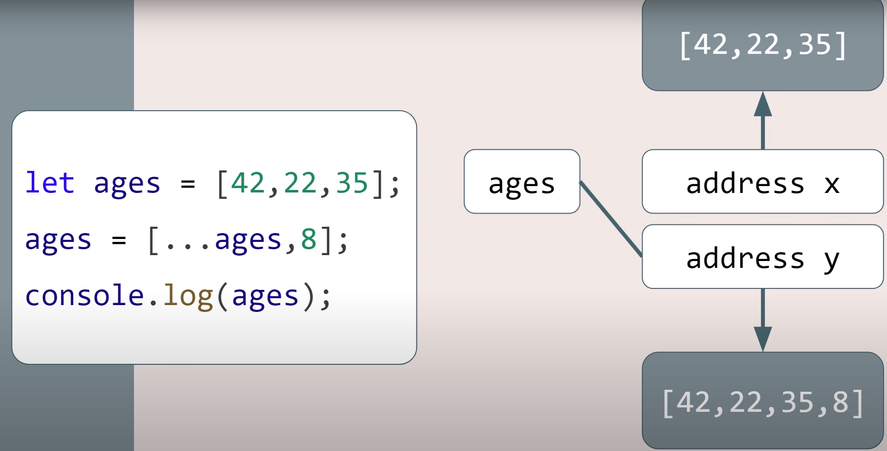

# Arrays: mutable
mutable by default, can be modified in place

Immutable       Mutable

| **Aspect**               | **Immutable**                                                                 | **Mutable**                                                  |
|--------------------------|------------------------------------------------------------------------------|-------------------------------------------------------------|
| **Definition**           | Cannot be changed after creation.                                           | Can be changed or updated after creation.                  |
| **Examples in Programming** | Strings, Numbers (JavaScript).                             |  Objects, Arrays (JavaScript). |
| **Memory Usage**         | New memory is allocated for each change.                                    | Changes occur in the same memory space.                    |
| **Thread Safety**        | Generally thread-safe due to immutability.                                  | Not thread-safe unless synchronized.                       |
| **Performance**          | Slower for frequent modifications (requires new copies).                   | Faster for frequent updates.                               |
| **Use Cases**            | Ideal for functional programming, caching, or maintaining historical data.  | Suitable for scenarios requiring frequent updates.          |
| **Data Integrity**       | Ensures consistency, as data cannot be accidentally modified.               | Risk of unintended changes if shared between components.    |
| **Array**       | ages.map(x=>x+1); ages.filter(x=>x>21); ages.slice(1,3)               | ages.push(9); ages.sort(); ages.splice(2,1,18)    |
