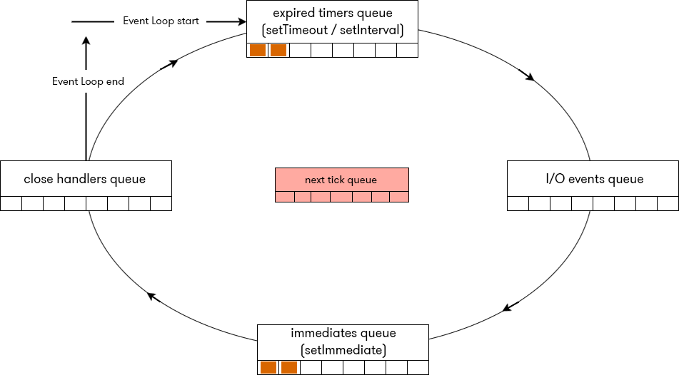
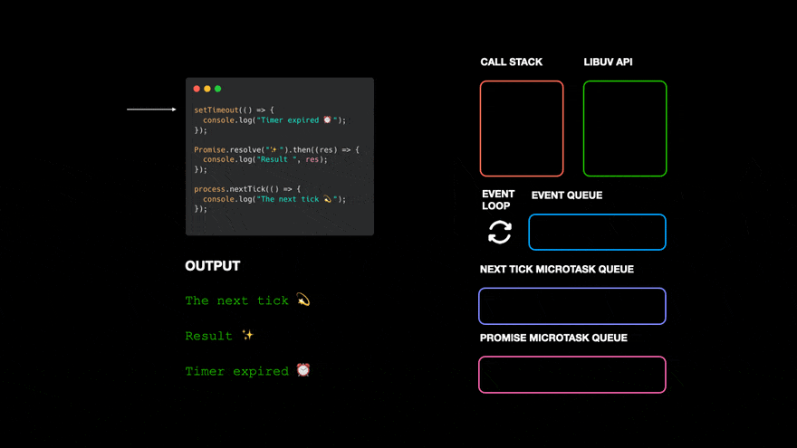

JS is a single-threaded, non-blocking programming language, which means it can execute one task at a time, but it doesn't blcok the thread while waiting for operations like I/O, networking requests, or timers. This is where the event loop comes into play. It is a fundamental concept that allows JS to handle asynchronous tasks effectively without freezing the user interface or blocking execution.
## Key Concept:
### 1.Single-Threaded: 
### 2.Non-Blocking
### 3. Asynchronous

# How the JS Event Loop works:
The event loop is the mechanism that handles the execution of code, events, and messages in the correct order, it operates alongside the Call Stack, Heap, Callback Queue(Task Queue), and microtask Queue
## The Component:
### 1.Call Stack: LIFO(First-In-Last-Out) principle 
### 2.Heap: The Heap is a memory structure where JS objects and variables are stored
### 3. Callback Queue (Task Queue): Asynchronous tasks(I/O, timers, setTimeout, event handles)
### 4.Microtask Queue: Microtasks includes promises(.then(), .catch()) and operations scheduled with queueMicrotask()

# The Event Loop Cycle:
### 1. Execute Synchronous Code: put the synchronous code into the call stack FILO.
### 2. Handle Asynchronous Tasks: place the asynchronous tasks into the CallBack Queue or MicroTasks Queue
### 3.Check the Call Stack: 
### 4. Execute Microtasks
### 5. Move to CallBack Queue
### 6.Repeat

You can check the code in [`Day08-EventLoop.js`](./Day08-EventLoop.js).

