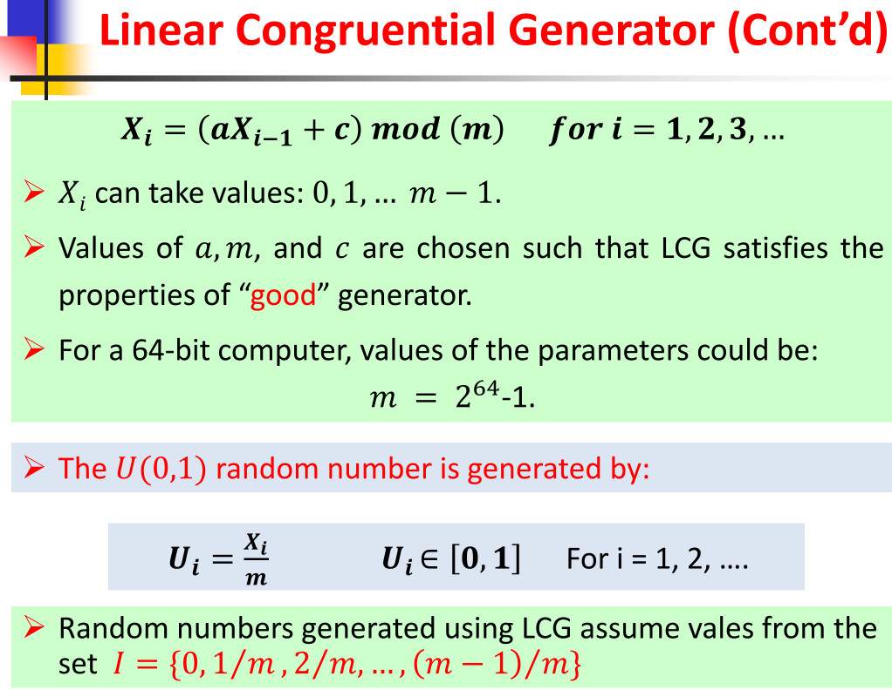

# Random-Number Generation
## 1. Random NUmbers
1-1. Random number generation is the basis for simulating such inputs
    1. Poisson
    2. Exponential
1-2. Random means the absence of order
1-3. Two Conditions:
    1. The values are uniformly distributed
    2. Impossible to predict future values based on past or present ones

## 2. Property of Random Numbers
    1. Uniformity : uniformly distributed
    2. Independence: independent of each other

## 3. LCG(Linear Congruential Generator)



Important properties to test are:
    1. Maximum density
    2. Maximum period

```js
    // 1. LCG(Linear Congruential Generator) algorithms
    // 2. The seed determines the sequence of random numbers
    function customRandom(seed){
        const modulus = 2 ** 31 -1
        const multiplier = 48271
        // 𝑿𝒊 = 𝒂𝑿𝒊−𝟏 + 𝒄 𝒎𝒐𝒅 𝒎 𝒇𝒐𝒓 𝒊 = 𝟏, 𝟐, 𝟑, …
        seed = (seed * multiplier) % modulus
        return seed/modulus 
    }
    let seed = 1234
    console.log(customRandom(seed))
```


