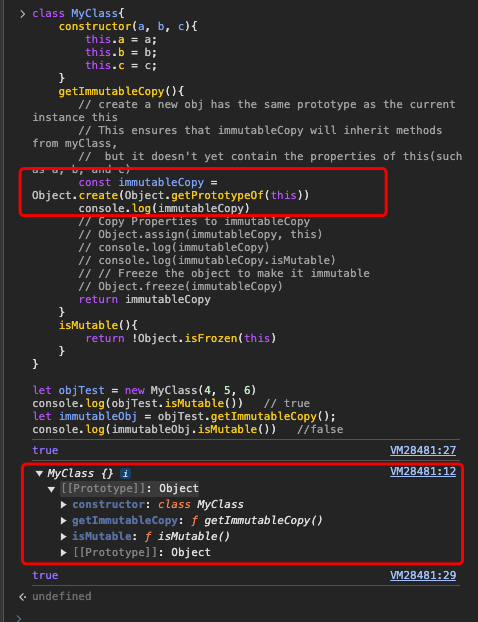

# Object built-in method
Object is a built-in global object that provides several methods for working with objects.
## Object.create()
```js
    // Object.create(proto, propertiesObject)
    // proto is used as the prototype of the new Object
    const person = {
        greet: function(){
            console.log('hello')
        }
    }
    const john = Object.create(person)
    john.greet();   // hello
```

## Object.assign()
```js
// Object.assign(target, ...sources)
    const obj1 = {
        'name': "Alice",
        'age': 25
    }

    const obj2 = {
        'job': "engineer",
        'city': 'London'
    }
    const merge = Object.assign(obj1, obj2)
    console.log(merge)  // { name: 'Alice', age: 25, job: 'engineer', city: 'London' }
    console.log(obj1) //{ name: 'Alice', age: 25, job: 'engineer', city: 'London' }
    console.log(obj2)  //{ job: 'engineer', city: 'London' }

    // Clone an object, shallow copy so will change the target object 
    const original = {a: 1, b:2}
    const copy = Object.assign({}, original)
    console.log(copy)  // { a: 1, b: 2 }

    let copy2 = {}
    Object.assign(copy2, original)
    console.log(copy2)  //{ a: 1, b: 2 }

```
## Object.freeze()
```js
    // Object.freeze(obj)
    const car = { make: "Toyota", model: "Corolla" };
    Object.freeze(car)
    car.make = '111'
    console.log(car.make)  // Toyota
```

## Object.isFrozen()
```js
    // Object.isFrozen(obj)
    const car2 = { make: "Toyota", model: "Corolla" };
    console.log(Object.isFrozen(car2))  //false

    Object.freeze(car2)
    console.log(Object.isFrozen(car2)) // true
```

## Object.keys()
```js
    const obj = { name: "Alice", age: 30 };
    console.log(Object.keys(obj))   //[ 'name', 'age' ]
```

## Object.values()
```js
    const obj2 = { name: "Alice", age: 30 };
    console.log(Object.values(obj2))   //[ 'Alice', 30 ]
```

## Object.entries()
```js
    const obj3 = { name: "Alice", age: 30 };
    console.log(Object.entries(obj3))   // [ [ 'name', 'Alice' ], [ 'age', 30 ] ]

    let map = Object.assign({}, obj3)
    for(let [key, value] of Object.entries(map)){
        console.log(key, value)  // name, Alice    
                                 // age, 30
    }
```

## Object.prototypeOf()
```js
    const obj4 = {}
    console.log(Object.getPrototypeOf(obj))  //[Object: null prototype] {}

    console.log(Object.getPrototypeOf(obj) == Object.prototype)   // true

```

## Object.getOwnPropertyNames(object1)

```js
    const obj5 = {
         a: 1,
         b: 2,
         c: 3,
    }
    console.log(Object.getOwnPropertyNames(obj5))   // Array ["a", "b", "c"]

```
## Object.fromEntries()
Converts an array of [key, value] pairs into an object,
the inverse of Object.entries()
```js
    const entries = [["name", "Alice"], ["age", 25]];
    console.log(Object.fromEntries(entries))   // { name: "Alice", age: 25 }

```


## Real Use Case
```js
    class MyClass{
        constructor(a, b, c){
            this.a = a;
            this.b = b;
            this.c = c;
        }
        getImmutableCopy(){
           // create a new obj has the same prototype as the current instance this
            // This ensures that immutableCopy will inherit methods from myClass, 
            //  but it doesn't yet contain the properties of this(such as a, b, and c)
            const immutableCopy = Object.create(Object.getPrototypeOf(this))
            console.log(immutableCopy)
            // Copy Properties to immutableCopy
            Object.assign(immutableCopy, this)
            // Freeze the object to make it immutable
            Object.freeze(immutableCopy)
            // return immutableCopy
        }
        isMutable(){
            return !Object.isFrozen(this)
        }
    }

    let objTest = new MyClass(4, 5, 6)
    console.log(objTest.isMutable())   // true
    let immutableObj = objTest.getImmutableCopy();
    console.log(immutableObj.isMutable())   //false

```
###  Note: Why is Object.assign() needed?
1. Without Object.assign(immutableCopy, this), immutableCopy would not have any of the properties(a, b, c) that are part of the original object this.
2. Object.create() only sets up the prototype chain; it doesn't copy any properties from the original object.

From the picture, We can easily see   const immutableCopy = Object.create(Object.getPrototypeOf(this)) immutableCopy inherit methods from MyClass, only set up the prototype chain.
So it needs Object.assign(immutableCopy, this), otherwise it cannot have any of the properties(a, b, c)


