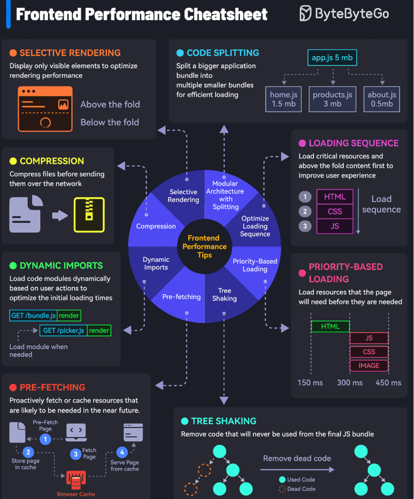

# Frontend Performance Cheetsheet

## 1. Compression: 
    Gzip HTML, CSS, JavaScript
    WebP compress images
## 2. Selective Rendering
    lazy-loading
    conditional rendering
## 3. Dynamic imports
    use ES6 import
## 4. Code Spliting
    Webpack
## 5. Tree Shaking(Remove the dead code)
    ES6 import/export
    tree shaking tools like webpack, Rollup
## 6. Loading Sequence
    defer or async script
Comparision async, defer, and default  
    1. async   
    Html parsing --> Pause parsing for script execution(Whenever downloaded) --> Continue parsing  
    2. Defer  
    Html parsing --> Complete parsing --> Execute Script in order  
    3. Default  
    Html parsing --> pause parsing then Download and execute script --> resume html parsing
## 7. Priority-Based Loading
    <link rel='preload'>
## 8. Pre-fetching
    <link rel='prefetch'>
