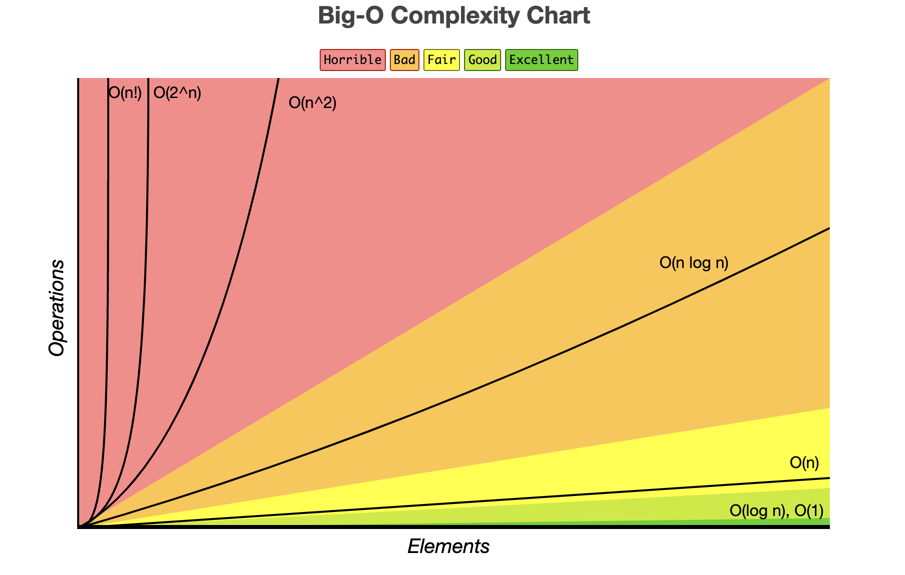

# Sorting Algorithms
## 1. Bubble Sort
Bubble Sort Repeatedly steps through the array, comparing adjacent items, if 2 items are in the worong order, they are swapped. This process repeats, moving the largest unsorted item to the end with each pass, until the entire array is sorted.  

### Steps
    1. start at the beginning of the array
    2. compare each pair of adjacent items
    3. swap the items if they are in the wrong order
    4. continue this process until no swaps are needed
You can find the more in [`bubbleSort.js`](./bubbleSort.js).

## 2. Selecion Sort
Selection Sort sorts an array by repeatedly finding the minimum element from the unordered position and moving it to the beginning  

### Steps
    1. start with the first item as the current minimum
    2. compare the current minimum with the rest of the array to find the smallest item
    3. if a smaller item is found, update the current minimum
    4. swap the current minimum with the first unordered item
    5. move to the next position and repeat until the array is sorted

You can find the more in [`selectionSort.js`](./selectionSort.js).

## 3. Insertion Sort

### Steps
    1. Start with the first element, assumign it's already sorted
    2. For each subsequent element, compare it with the elements in the sorted position(the element before it)
    3  If find the subsequent element greater than the previous then insert the num to the correct position
    4. Repeat until all the elements in the array are sorted
You can find the more in [`insertionSort.js`](./insertionSort.js).

## 4. Merge Sort
merge sort use the divide-and-conquer approach to sort the array efficiently  
   

### Steps
1. Divide
    #### 1. break the array in half
    #### 2. base case: when arr.length is 1
    #### 3. use merge to put array together
2. Conquer(merge function) to combine the individual components back into a  sorted list  
 
You can find the mergeSort in [`mergeSort.js`](./mergeSort.js).

## 5.Quick Sort
Quick sort use the Divide-and-Conquer approach choose the pivot to sort the array effectivly  

### Steps
1. Divide
    ### Choose the privot to split the arry into 2 parts
2. Conquer
   ### Left + Pivot + Right
You can find the more in [`QuickSort.js`](./quickSort.js).

## 6. Summary Table
| Algorithm       | Time Complexity (Best) | Time Complexity (Worst) | Space Complexity (Best) | Space Complexity (Worst) |
|-----------------|------------------------|--------------------------|--------------------------|---------------------------|
| Bubble Sort     | O(n)                   | O(n²)                    | O(1)                     | O(1)                      |
| Selection Sort  | O(n²)                  | O(n²)                    | O(1)                     | O(1)                      |
| Insertion Sort  | O(n)                   | O(n²)                    | O(1)                     | O(1)                      |
| Merge Sort      | O(n log n)             | O(n log n)               | O(n)                     | O(n)                      |
| Quick Sort      | O(n log n)             | O(n²)                    | O(log n)                 | O(n)                      |

You also can check all the  Array Sorting Algorithms comparison table below

You also can check all the  Big-O Complexity Chart Below

You also can check the Simplistic Big-O Complexity Chart Below
