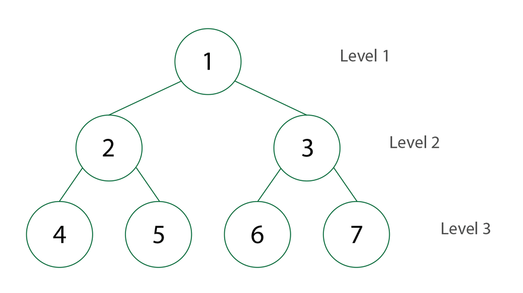
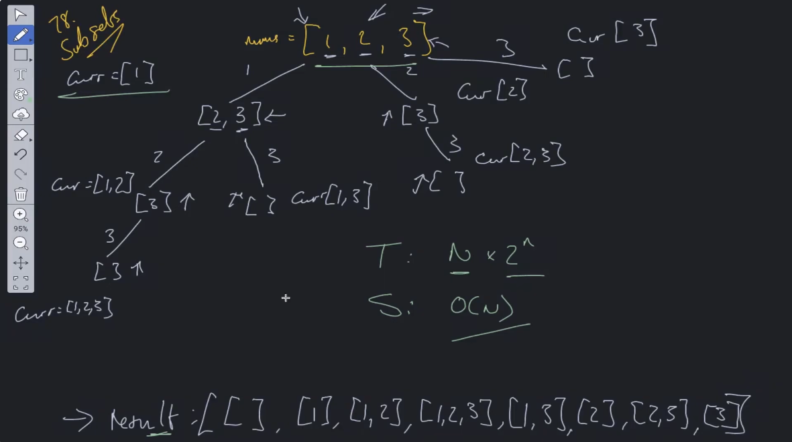

This is the Cheatsheet for DSA


# 1. HashMaps

You also can find the HashMaps details in #4HashMap [`Top8-FrequencyDataStructure.md`](./Top8-FrequencyDataStructure.md).</br>

LeetCode Problems:
1. LeetCode 1. Two Sum https://leetcode.com/problems/two-sum/description/ </br>
You also can find the code in [`twoSum.js`](./twoSum.js).

2. LeetCode 12. Integer to Roman https://leetcode.com/problems/integer-to-roman/description/?envType=problem-list-v2&envId=hash-table </br>
You also can find the romanToInt use case in [`romanToInt.js`](./romanToInt.js).
3. LeetCode 17. Letter Combinations of a Phone Number https://leetcode.com/problems/letter-combinations-of-a-phone-number/description/?envType=problem-list-v2&envId=hash-table </br>
You also can find the code in [`letterCombinations.js`](./letterCombinations.js). </br>
 
4. LeetCode 36. Valid Sudoku https://leetcode.com/problems/valid-sudoku/description/?envType=problem-list-v2&envId=hash-table </br>
You also can find the code in [`validSudoku.js`](./validSudoku.js).
5. LeetCode 347. Top K Frequent Elements https://leetcode.com/problems/top-k-frequent-elements/  </br>
You also can find the code in [`topKFrequent.js`](./topKFrequent.js).

6. LeetCode 146. LRU cache https://leetcode.com/problems/lru-cache/description/?envType=problem-list-v2&envId=hash-table </br>
You also can find the code in [`LeastRencentlyUsedCache.js`](./LeastRencentlyUsedCache.js).

# 2. Recursion
## Key Features
### 1. Base Case to break the infinite loops
### 2. Recursive Relation
```js
    function generatePascalTriangle(numRows){
        //Base Case
        if(numRows == 1) return [[1]]
        if(numRows == 2) return [[1], [1,1]]
        let preRow = generatePascalTriangle(numRows - 1)
        let nowRow = new Array(numRows).fill(1)
        // Recurrsion Relation
        for(let i = 2; i < numRows -1; i++){
            nowRow[i] = preRow[numRows-2][i-1] + preRow[numRows-2][i]
        }
        preRow.push(nowRow)
        return preRow
    }
    console.log(generatePascalTriangle(5))
    // [
    //     [1] 
    //     [1, 1]
    //     [1, 1, 1]
    //     [1, 1, 2, 1] 
    //     [1, 1, 3, 3, 1]
    //     [1, 1, 4, 6, 4, 1]
    //     [1, 1, 5, 10, 10, 5, 1]
    // ]
```
You also can find the recursion use case in [`pascalTriangle.js`](./pascalTriangle.js).

For more you can check more about the Recursion [`Recursion.md`](./Recursion.md).
# 3. Two traversal solutions: DFS & BFS 

## 3.1 BFS(Breadth-First-Search) use Queue(FIFO) data structure



You also can find the Code in [`BST-BFS.js`](./BST(BinarySearchTree)/BST-BFS.js).

You can check the frontend use case in [`BST-BFS-DomTraversel.js`](./BST(BinarySearchTree)/BST-BFS-DomTraversel.js).
## 3.2 DFS(Depth-First-Search) use Stack(FILO) data structure
### Pre-Order(Root-Left-Right)


You also can find the Code in [`BST-DFS-PreOrder.js`](./BST(BinarySearchTree)/BST-DFS-PreOrder.js).
### Post-Order(Left-Right-Root)

You also can find the Code in [`BST-DFS-PostOrder.js`](./BST(BinarySearchTree)/BST-DFS-PostOrder.js).
### In-Order(Left-Root-Right)

You also can find the Code in [`BST-DFS-InOrder.js`](./BST(BinarySearchTree)/BST-DFS-InOrder.js).

You can check the frontend use case in [`BST-DFS-RenderTree.js`](./BST(BinarySearchTree)/BST-DFS-RenderTree.js).

LeetCode Problems:
1. LeetCode 102. Binary Tree Level Order Traversal https://leetcode.com/problems/binary-tree-level-order-traversal/?envType=study-plan-v2&envId=top-100-liked  </br>
You can find the code solution in [`BT-levelOrder.js`](./BT-levelOrder.js)
2. LeetCode 547. Number of Provinces  https://leetcode.com/problems/number-of-provinces/description/ </br>
You can find the code solution in [`Graph-findCircleNum.js`](./Graph-findCircleNum.js)
3. LeetCode 105. Construct Binary Tree From Preorder And Inorder Traversal  https://leetcode.com/problems/construct-binary-tree-from-preorder-and-inorder-traversal/description/?envType=study-plan-v2&envId=top-100-liked </br>
You can find the code solution in [`BT-BuildTree-FromPreOrderAndInOrder.js`](./BT-BuildTree-FromPreOrderAndInOrder.js)
4. LeetCode 108. Convert Sorted Array to Binary Search Tree https://leetcode.com/problems/convert-sorted-array-to-binary-search-tree/description/?envType=study-plan-v2&envId=top-100-liked </br>
You can find the code solution in [`BST-SortedArrayToBST.js`](./BST(BinarySearchTree)/BST-SortedArrayToBST.js)
5. LeetCode 98. Valid Binary Search Tree https://leetcode.com/problems/validate-binary-search-tree/description/?envType=study-plan-v2&envId=top-100-liked </br>
You can find the code solution in [`BST-ValidateBST.js`](./BST(BinarySearchTree)/BST-ValidateBST.js)

6. LeetCode 79. Word Search https://leetcode.com/problems/word-search/ </br>
You can find the code solution in [`wordSearch-exist.js`](./wordSearch-exist.js)


# 4. Binary Search
Binary Search is an efficient algorithm for finding an element's position in a ### Sorted Array ###
## Key Features
### 1. Divide and Conquer Strategy
    1. Approach: Binary Search follows the divide and conquer principle, dividing the array into halves to systematically reduce the problem size.
    2.Operation: If target is less than the middle element, search the left half, if it is greater, search the right half.
### 2. Logarithmic Time Complexity
    1. Efficiency: Time Complexity of Binary Search is O(logn). This is because with each step, the search space is halved.
    2. Scalability: This makes binary search much faster than linear Search(O(n)), especially for large data sets.
### 3. Sorted Array Requirement
    1. Prerequisite: The array must be sorted before applying binary search.
    2. Preprocessing: If the input data is unsorted, sorting algorithms like merge sort or quick sort can be used first.
You can find the mergeSort in [`mergeSort.js`](../LeetCode-Solution/Sorting/mergeSort.js). </br>
You can find the quickSort in [`quickSort.js`](./Sorting/mergeSort.js).
### 4. Iterative and Recursive implementations
    1. Iterative Method: Use a loop to traverse through the array.
    2. Recursive Method: Calls the function itself with updated search ranges.

LeetCode Problems
1. LeetCode 704. Binary Search https://leetcode.com/problems/binary-search/  </br>
You can find the code solution in [`binarySearch.js`](./binarySearch.js)
2. LeetCode 33. Search in Rotated Sorted Array https://leetcode.com/problems/search-in-rotated-sorted-array/description/ </br>
You can find the code solution in [`searchInRotatedArray.js`](./searchInRotatedArray.js)
3. LeetCode 374. Guess Number Higher or Lower https://leetcode.com/problems/guess-number-higher-or-lower/description/  </br>
4. LeetCode 295 Find Median From Data Stream https://leetcode.com/problems/find-median-from-data-stream/description/  </br>
You can find the code solution in [`findMedianFromDataStream.js`](./findMedianFromDataStream.js)
5. LeetCode 153 Find Minimum In Rotated Sorted Array https://leetcode.com/problems/find-minimum-in-rotated-sorted-array/description/ </br>
You can find the code solution in [`findMinInRotatedArray.js`](./findMinInRotatedArray.js)

6. LeetCode 2300 Successful Pairs of Spells and Potions https://leetcode.com/problems/successful-pairs-of-spells-and-potions/?envType=study-plan-v2&envId=leetcode-75 </br>
You can find the code solution in [`successfulPairs.js`](./successfulPairs.js)


# 5. Sliding Window
Reducing the time complexity of naive solutions(brute force) often turning O(n*n) or O(n*n*n) into O(n)
## 1. Key Features
### 1. Window Definition
### 2. Two Pointers: The sliding window technique usually uses two-pointers to represent the start and end of the window
### 3. Dynamic Adjustment: Start Pointer forward to shrink the window or move the end pointer to expand it.

## 2. Types of Problems solved with Sliding window:
###   1. Finding the longest/shortest substring without repeating characters
###   2. Finding the maximum/minimum sum of a subarray of fixed length
###  3. Finding subarrays that meet the certain conditions(eg,sum, product)

LeetCode Problems
1. LeetCode 125. Valid Palindrome https://leetcode.com/problems/valid-palindrome/  </br>
You can find the code solution in [`validPalindrome.js`](./validPalindrome.js)
2. LeetCode 121. Best Time to Buy and Sell Stock
https://leetcode.com/problems/best-time-to-buy-and-sell-stock/description/ </br>
You can find the code solution in [`bestTimeToSellStock.js`](./bestTimeToSellStock.js)
3. LeetCode 15. 3Sum https://leetcode.com/problems/3sum/description/ </br>
You can find the code solution in [`3Sum.js`](./3Sum.js)

4. LeetCode 647. Palindromic Substrings https://leetcode.com/problems/palindromic-substrings/description/ </br>
You can find the code solution in [`countSubstrings.js`](./countSubstrings.js)

5. LeetCode3.Longest Substring Without Repeating Characters https://leetcode.com/problems/
longest-substring-without-repeating-characters/description/  </br>
You can find the code solution in [`lengthOfLongestSubstring.js`](./lengthOfLongestSubstring.js)

Note: Binary Search also use two-pointers technique


# 6.  Backtracking
Backtracking is a general algorithmic technique in a lot of languages used to solve problems incrementally by building a solution piece-by-piece and removing(backtracking) solutions that fail to meet the problem constrains. This technique is especially helpful for problems involving combinations, permutations, and other situations where multiple possibilities must be explored.
## Key Concepts of backtracking
    1. Exploration of all possibilities.
    2. Recursive Exploration: Most of backtracking algorithms are implemented recursively because each step of the process depends on the previous choices.
    3. Backtracking Steps
    4. Constraints and Pruning
## Tips for Backtracking in JS
    1. Use Recursively carefully: Since Backtracking relies heavily on recursion, JS's call stack limit should be keep in mind.
    2. Prune Early: Adding checks early in the recursion to eliminate unpromising paths can significantly optimize performance
    3. Data Structures: Using appropriate data structures like arrays, sets and maps can help manage visited nodes, choices, or constraints efficiently.

LeetCode Problems:
1. LeetCode 17. Letter Combinations of a Phone Number https://leetcode.com/problems/letter-combinations-of-a-phone-number/description/?envType=problem-list-v2&envId=hash-table </br>
You also can find code solution in [`letterCombinations.js`](./letterCombinations.js).

2. LeetCode 78. Subsets https://leetcode.com/problems/subsets/description/ </br>
You also can find code solution in [`subset.js`](./subsets.js).

3. LeetCode 77. Combinations https://leetcode.com/problems/combinations/description/ </br>
You also can find code solution in [`combinations.js`](./combinations.js).

# 7. Dynamic Programming
LeetCode Problems:
1. LeetCode 121. Best Time to Buy and Sell Stock
https://leetcode.com/problems/best-time-to-buy-and-sell-stock/description/ </br>
you can find the explanation in
 
You can find the code solution in [`bestTimeToSellStock.js`](./bestTimeToSellStock.js)

2. LeetCode 152. Maximum Product Subarry
https://leetcode.com/problems/maximum-product-subarray/description/
You can find the code solution in [`maxProductSubarray.js`](./maxProductSubarray.js)

3. LeetCode 70 Climbing Stairs
https://leetcode.com/problems/climbing-stairs/description/
You can find the code solution in [`climbStairs.js`](./climbStairs.js)


# 8. Greedy