# Top 8 Data Structure Frequently Used
## 1.0. Strings

LeetCode Problems:
1. LeetCode 1382. Break a Palindrome https://leetcode.com/problems/break-a-palindrome/description/  </br>
You can find the code solution in [`breakPalindrome.js`](./breakPalindrome.js)
2. LeetCode 151. Reverse words in a string https://leetcode.com/problems/reverse-words-in-a-string/?envType=problem-list-v2&envId=string </br>
You can find the code solution in [`reverseWords.js`](./reverseWords.js)
3. LeetCode 28. Find the Index of the First Occurrence in a String
https://leetcode.com/problems/find-the-index-of-the-first-occurrence-in-a-string/description/?envType=problem-list-v2&envId=string</br>
You can find the code solution in [`firstOccurSubstring.js`](./firstOccurSubstring.js) </br>
4. LeetCode 3. Longest Substring Without Repeating Characters. https://leetcode.com/problems/longest-substring-without-repeating-characters/description/?envType=problem-list-v2&envId=string </br>
You can find the code solution in [`lengthOfLongestSubstring.js`](./lengthOfLongestSubstring.js)
5. LeetCode 14. Longest Common Prefix https://leetcode.com/problems/longest-common-prefix/description/?envType=problem-list-v2&envId=string </br>
You can find the code solution in [`longestCommonPrefix.js`](./longestCommonPrefix.js)
6. LeetCode 17. Letter Combinations of a phone number https://leetcode.com/problems/letter-combinations-of-a-phone-number/?envType=problem-list-v2&envId=string </br>
You can find the code solution in [`letterCombinations.js`](./letterCombinations.js)
7. LeetCode 49 Group Anagrams https://leetcode.com/problems/group-anagrams/?envType=problem-list-v2&envId=string </br>
You can find the code solution in [`groupAnagrams.js`](./groupAnagrams.js)
8. LeetCode 345. Reverse Vowels of a String https://leetcode.com/problems/reverse-vowels-of-a-string/description/?envType=study-plan-v2&envId=leetcode-75 </br>
You can find the code solution in [`reverseVowelsInString.js`](./reverseVowelsInString.js)

9. LeetCode 238 Product of Array Except Self https://leetcode.com/problems/product-of-array-except-self/?envType=study-plan-v2&envId=leetcode-75 </br>
You can find the code solution in [`productExceptSelf.js`](./productExceptSelf.js)

10. LeetCode 43 Multiply Strings https://leetcode.com/problems/multiply-strings/?envType=problem-list-v2&envId=string  </br>
You can find the code solution in [`multiplyStrings.js`](./multiplyStrings.js)

11. LeetCode 67 Add Binary https://leetcode.com/problems/add-binary/?envType=problem-list-v2&envId=string </br>
You can find the code solution in [`addBinary.js`](./addBinary.js)

12. LeetCode 415 Add Strings https://leetcode.com/problems/add-strings/description/ </br> Derived from add Binary to add Strings 
You can find the code solution in [`addStrings.js`](./addStrings.js)

13. LeetCode 88 Merge Sorted Array https://leetcode.com/problems/merge-sorted-array/description/?envType=study-plan-v2&envId=top-interview-150 </br>
You can find the code solution in [`mergeTwoOrderArr.js`](./mergeTwoOrderArr.js)

14. LeetCode 8. String to Integer(atoi) https://leetcode.com/problems/string-to-integer-atoi/description/?envType=problem-list-v2&envId=string </br>
You can find the code solution in [`stringToInteger.js`](./stringToInteger.js)

15. LeetCode 242 Valid Anagram https://leetcode.com/problems/valid-anagram/description/?envType=problem-list-v2&envId=string </br>
You can find the code solution in [`isAnagram.js`](./isAnagram.js)

16. LeetCode 42 Trapping Rain Water https://leetcode.com/problems/trapping-rain-water/?envType=study-plan-v2&envId=top-interview-150 </br>
You can find the code solution in [`trapRainWater.js`](./trapRainWater.js)

17. LeetCode 26. Remove Duplicates from Sorted Array
https://leetcode.com/problems/remove-duplicates-from-sorted-array/?envType=study-plan-v2&envId=top-interview-150 </br>
You can find the code solution in [`tremoveDuplicates.js`](./removeDuplicates.js)

18. LeetCode 383. Ransom Note, https://leetcode.com/problems/ransom-note/?envType=study-plan-v2&envId=top-interview-150 </br>
You can find the code solution in [`canConstruct.js`](./canConstruct.js)

19. LeetCode 205 Isomorphic Strings https://leetcode.com/problems/isomorphic-strings/description/?envType=study-plan-v2&envId=top-interview-150 </br>
You can find the code solution in [`isIsomorphic.js`](./isIsomorphic.js)

20. LeetCode 392. Is Subsequence https://leetcode.com/problems/is-subsequence/description/?envType=study-plan-v2&envId=top-interview-150 </br>
You can find the code solution in [`isSubsequence.js`](./isSubsequence.js)

21. LeetCode 6. ZigZag Conversion https://leetcode.com/problems/zigzag-conversion/ </br>
You can find the code solution in [`zigzagConversion.js`](./zigzagConversion.js)

22. LeetCode 169. Majority Element https://leetcode.com/problems/majority-element/description/?envType=study-plan-v2&envId=top-interview-150
You can find the code solution in [`majorityElement.js`](./majorityElement.js)

23. LeetCode 274. H-Index https://leetcode.com/problems/h-index/?envType=study-plan-v2&envId=top-interview-150 </br>
You can find the code solution in [`hIndex.js`](./hIndex.js)


## 1.1. Array
array is a placed subsequentially in memory, with each element directly following the previous one.

### features
    1. Efficient Access
    2. Cache-Friendly
    3. Fixed Size
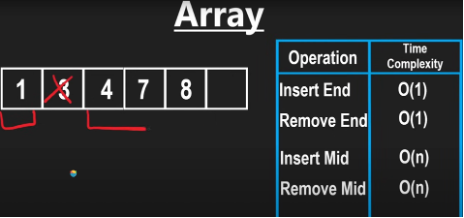
 ```js
    const arr = [1,2,3,4,5]
    // push and pop Time Complexity O(1)
    arr.push(6)
    arr.pop()
    // unshift, shift Time Complexity O(n)
    arr.unshift(-1)
    arr.shift()
    console.log(arr)   // [1,2,3,4,5]
```
| Features | Array                                      | Set                          |
|----------|--------------------------------------------|------------------------------|
| Create   | let arr = [], arr2 = new Array()           | let set = new Set()          |
| value    | Any Types(primitives, object, duplicates ) | Unique values only, any type |
| Access   | arr[index]                                 | set.has(val)                 |
| Add      | arr.push(value)                            | set.add(val)                 |
| Update   | arr[index] = newValue                      | set.delete(value); set.add(newValue)               |
| Delete   | arr.splice(index, 1)                       | set.delete(val)              |
| Size     | arr.length                                 | set.size                     |
| Looping     | for, ForEach, for...of, for...in, map,etc                              | forEach, for...of  you cannot access elements by index                   |
| Mutual Convert     | new Set(arr)                                | Array.from(set); [...set]                   |

1. LeetCode 380 Insert Delete GetRandom O(1) https://leetcode.com/problems/insert-delete-getrandom-o1/?envType=study-plan-v2&envId=top-interview-150 </br>
You can find the function definition in [`RandomizedSet.js`](./RandomizedSet.js).
 

## 2. Queue(First-In-First-Out),  Stack(First-In-Last-Out)
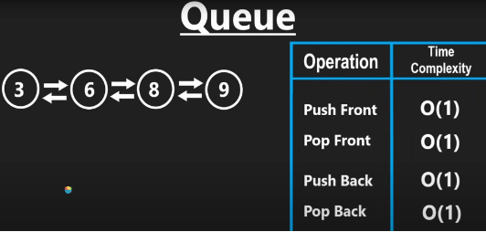

### Stack use scenarios
LeetCode Problems:
1. You can find the function definition in [`validParentheses.js`](./validParentheses.js).
2. LeetCode 71 Simplify Path https://leetcode.com/problems/simplify-path/ </br>
You can find the function definition in [`simplifyPath.js`](./simplifyPath.js).

3. LeetCode 155 Min Stack https://leetcode.com/problems/min-stack/?envType=study-plan-v2&envId=top-interview-150
</br>
You can find the function definition in [`MinStack.js`](./MinStack.js).

4. LeetCode 150 Evaluate Reverse Polish Notation https://leetcode.com/problems/evaluate-reverse-polish-notation/description/?envType=study-plan-v2&envId=top-interview-150 </br>
You can find the function definition in [`evalRPN.js`](./evalRPN.js).


## 3. Linked List
Unlike arrays, Linked List known as nodes
Linked List is a random placement in memory.
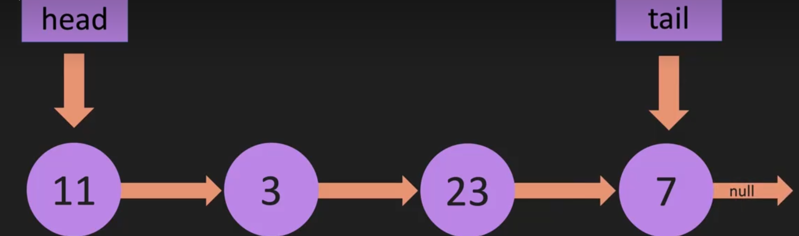
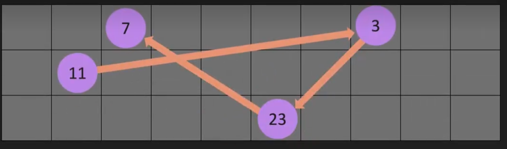
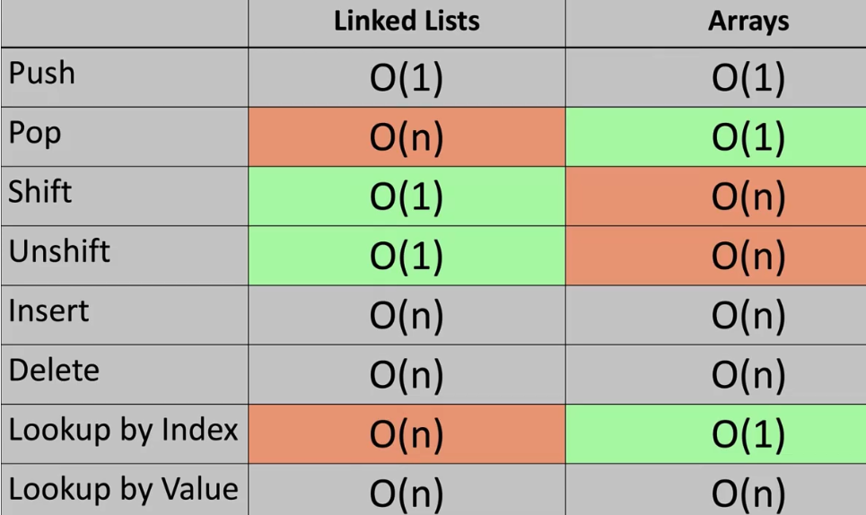

You can find the Code in [`LL-Create.js`](./LL(LinkedList)/LL-Create.js). </br>
You can find the Code in [`LL-Push.js`](./LL(LinkedList)/LL-Push.js).</br>
You can find the Code in [`LL-Pop.js`](./LL(LinkedList)/LL-Pop.js).</br>
You can find the Code in [`LL-Unshift.js`](./LL(LinkedList)/LL-Unshift.js).</br>
You can find the Code in [`LL-Shift.js`](./LL(LinkedList)/LL-Shift.js).</br>
You can find the Code in [`LL-Get.js`](./LL(LinkedList)/LL-Get.js).</br>
You can find the Code in [`LL-Set.js`](./LL(LinkedList)/LL-Set.js).</br>
You can find the Code in [`LL-Remove.js`](./LL(LinkedList)/LL-Remove.js).</br>

LeetCode Problems:
1. LeetCode 206. Reverse Linked List https://leetcode.com/problems/reverse-linked-list/description/
</br>
You can find the Code in [`LL-reverseList.js`](./LL(LinkedList)/LL-reverseList.js). 

2. LeetCode 141. Linked List Cycle https://leetcode.com/problems/linked-list-cycle/description/?envType=study-plan-v2&envId=top-interview-150 </br>
You can find the Code in [`LL-hasCycle.js`](./LL(LinkedList)/LL-hasCycle.js).</br>

3. LeetCode 234. Palindrome Linked List https://leetcode.com/problems/palindrome-linked-list/
You can find the Code in [`LL-isPalindrome.js`](./LL(LinkedList)/LL-isPalindrome.js).</br>

4. LeetCode 61. Rotate List https://leetcode.com/problems/rotate-list/description/?envType=study-plan-v2&envId=top-interview-150 </br>
You can find the Code in [`LL-rotateRight.js`](./LL(LinkedList)/LL-rotateRight.js).</br>


## 4. HashMap(Key-Value Pairs, in JavaScript can use Object/Map)
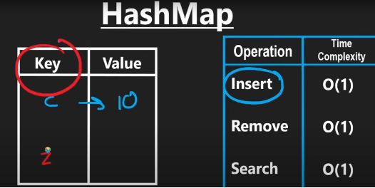
 ```js
   const map = new Map([
    ['name', 'Flora'],
    ['age', 25],
    ['method', ()=>{console.log('I am a method')}]
   ])

    // loop map
    map.forEach((value, key)=>{
        console.log(`${key}----${value}`)
    })
    // name---Alice
    // age---25
    // method---()=>{console.log('I am a method')}

    for(let [key, value] of map){
        console.log(`${key}======${value}`)
    }
    // name=====Alice
    // age=====25
    // method=====()=>{console.log('I am a method')}

```
If you want to learn more about the Map data structure use in JavaScript scenarios, you can find the use case in [`timeLimitedCache.js`](./timeLimitedCache.js).

In JavsScript, 2 solutions to create HashMap data structure

| Feature            | Object                                                                                        | Map                                                                   |
|--------------------|-----------------------------------------------------------------------------------------------|-----------------------------------------------------------------------|
| Create             | let obj = {}, obj2 = new Object, obj3 = Object.create({name: 'flora'}), obj4 = {name:'flora'} | let map = new Map(), map2 = new Map([['name', 'Flora'], ['age', 25]]) |
| Key Types          | Strings and Symbols                                                                           | Any Values(Object, functions, primitive values)                       |
| Order of Keys      | No guaranteed order                                                                           | Maintains the order of keys based on insertion                        |
| Size               | NO buil-in Methods to get the size                                                            | map.size                                                              |
| Performance        | faster for lookups when using string keys                                                     | More efficient for frequent additions and removals                    |
| Add                | obj[key] = value                                                                              | map.set(key, value)                                                   |
| Access             | obj[key]                                                                                      | map.get(key)                                                          |
| Loop             | for...in, Object.keys(), Object.values(), Object.entries()                                                                                     | forEach(), for...of, map.keys(), map.values(), map.entires()                                                          |
| Delete             | delete obj[key]                                                                               | map.delete(key)                                                       |
| Checking existence | key in obj or obj.hasOwnProperty(key)                                                         | map.has(key)                                                          |
| Clone              | Object.assign() or ...                                                                        | new Map(existingMap)                                                  |
| Memory Usage       | Generally uses less memory for small sets                                                     | More memory-efficient for larger set                                  |

In JS, there is no built-in "HashTable" class, but JS object{} and the Map class often similar functionality to a HashTable
HashTable:
2 key features:  one-way, deterministic
collisions: seperate chain ; linear probing(open addressing)

LeetCode Problems:
1. LeetCode 2622. Cache With Time Limit https://leetcode.com/problems/cache-with-time-limit/?envType=study-plan-v2&envId=30-days-of-javascript </br>
you can find the Code in [`Map-TimeLimitedCache.js`](./Map-TimeLimitedCache.js).
2. LeetCode 146 LRU Cache https://leetcode.com/problems/lru-cache/description/?envType=problem-list-v2&envId=hash-table </br>
you can find the Code in [`Map-LRUCache.js`](./Map-LRUCache.js).

3. LeetCode 359. Logger Rate Limit https://leetcode.com/problems/logger-rate-limiter/description/

you can find the Code in [`loggerRateLimit.js`](./loggerRateLimit.js).


## 5. Binary Tree
### 1. Binary Search Tree (left node is always smaller than the root, while the right node is always larger than root)
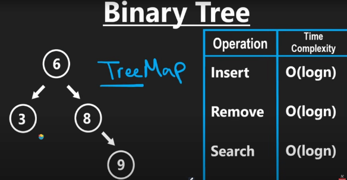

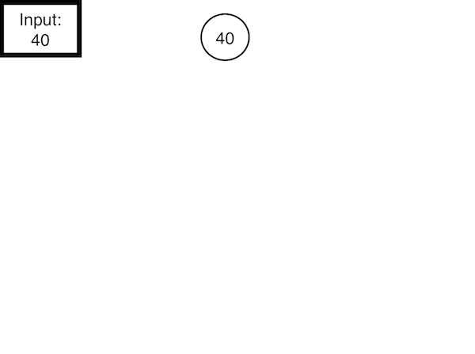
1. First create a tree 
[`BST-Create.js`](./BST(BinarySearchTree)/BST-Create.js).

 </br>
2. Insert BST </br>
[`BST-Insert.js`](./BST(BinarySearchTree)/BST-Insert.js).

3. Contains node
[`BST-Contains.js`](./BST(BinarySearchTree)/BST-Contains.js).

4. Find the minimum of the currentNode
[`BST-Findmin.js`](./BST(BinarySearchTree)/BST-Findmin.js).

5. Find the maxmum of the currentNode
[`BST-FindMax.js`](./BST(BinarySearchTree)/BST-FindMax.js).

6. You can find the whole BST code in 
[`BST-Whole.js`](./BST(BinarySearchTree)/BST-Whole.js).

7. Invert Binary Tree
You can find the code in 
[`BST-InvertTree.js`](./BST(BinarySearchTree)/BST-InvertTree.js).

8. LeetCode 235. Lowest Common Ancestor of a Binary Search Tree
https://leetcode.com/problems/lowest-common-ancestor-of-a-binary-search-tree/
You can find the code in 
[`BST-InvertTree.js`](./BST(BinarySearchTree)/BST-lowestCommonAncestor.js).

9. LeetCode 450 Delete Node in a BST https://leetcode.com/problems/delete-node-in-a-bst/description/ </br>
You can find the code in 
[`BST-DeleteNode.js`](./BST(BinarySearchTree)/BST-DeleteNode.js).

10. LeetCode 230 Kth Smallest Element in a BST https://leetcode.com/problems/kth-smallest-element-in-a-bst/description/ </br>
You can find the code in 
[`BST-KthSmallestElement.js`](./BST(BinarySearchTree)/BST-KthSmallestElement.js).

11. LeetCode 572. Subtree of Another SubTree https://leetcode.com/problems/subtree-of-another-tree/description/ </br>
You can find the code in 
[`BT-isSubTree.js`](./BT(BinaryTree)/BT-isSubTree.js).

### Key Points for `isValidBST` Function
- Uses recursion to validate each node.
- Each node’s value should be within a specific range (`min` and `max` bounds).

You can find the function definition in [`validateBST.js`](./validateBinarySearchTree.js).

### 2. Maximum Depth of Binary Tree
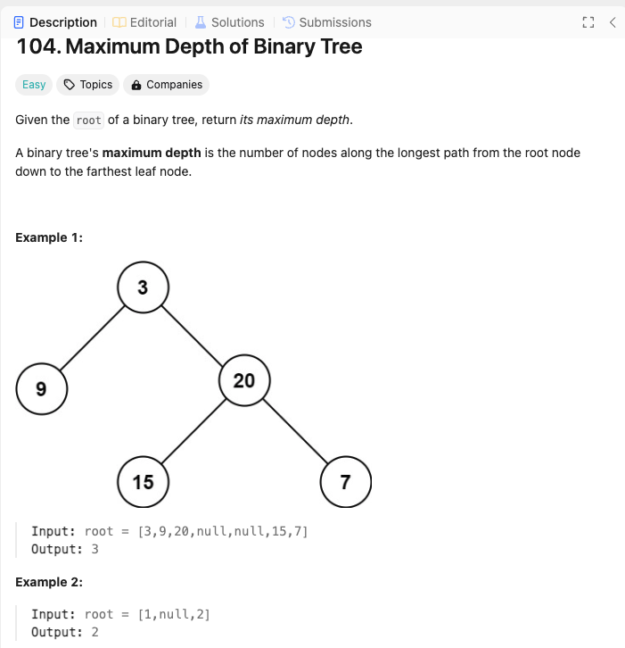
You can find the function definition in [`maxDepthBinaryTree.js`](./maxDepthBinaryTree.js).

### 3. Breadth-First-Search(BST)
You can find the function definition in [`BreadthFirstSearch.js`](./BreadthFirstSearch.js).


##  6. Trie/Prefix Tree   26 alphabets
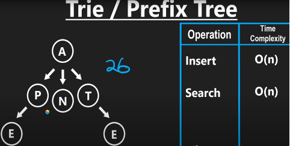
LeetCode Problems: 
1. LeetCode 208 Implement Trie(Prefix Tree) https://leetcode.com/problems/implement-trie-prefix-tree/description/?envType=study-plan-v2&envId=top-interview-150 </br>
You can find the code in [`Trie.js`](./Trie.js).

2. LeetCode 211.Design Add and Search Words Data Structure https://leetcode.com/problems/design-add-and-search-words-data-structure/ </br>
You can find the code in [`Trie-WordDictionary.js`](./Trie-WordDictionary.js).


##  7. Heap
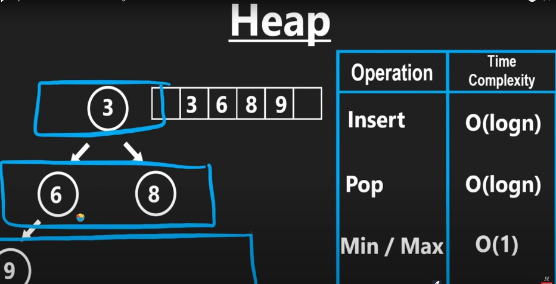
## 8. Graph

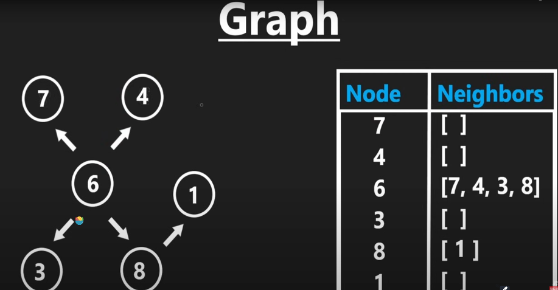

graph has 2 different solutions to represent
You can find the BFS(Breadth-First-Search graph) function definition in [`bfsGraph.js`](./bfsGraph.js).

LeetCode problems:
1. Leetcode 547. Number of Provinces https://leetcode.com/problems/number-of-provinces/description/?envType=study-plan-v2&envId=leetcode-75 </br>
You can find the code solution in [`Graph-findCircleNum.js`](./Graph-findCircleNum.js).

# Bit Manipulation
XOR ^  only o^1 = 1
<Br>
LeetCode problems:
1. Leetcode 268. Missing Number https://leetcode.com/problems/missing-number/description/ </br>
You can find the code solution in [`missingNumber.js`](./missingNumber.js).

# Matrix
LeetCode problems:
1. LeetCode 54 Spiral Matrix https://leetcode.com/problems/spiral-matrix/
You can find the code solution in [`spiralOrderMatrix.js`](./spiralOrderMatrix.js).
2. LeetCode 73 Set Matrix Zeroes https://leetcode.com/problems/set-matrix-zeroes/description/
You can find the code solution in [`setMatrixZeroes.js`](./setMatrixZeroes.js).
3. LeetCode 48 Rotate Image https://leetcode.com/problems/rotate-image/description/?envType=study-plan-v2&envId=top-interview-150 </br>
You can find the code solution in [`rotateMatrix90Degrees.js`](./rotateMatrix90Degrees.js).

##  9. Wrap-Up
You also can check all the Common Data Structure Operations  table below
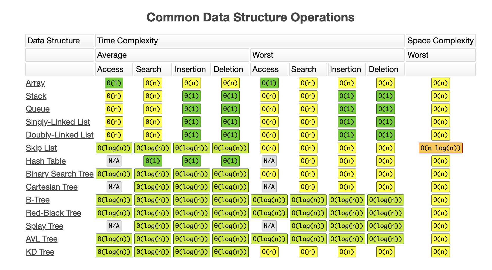
